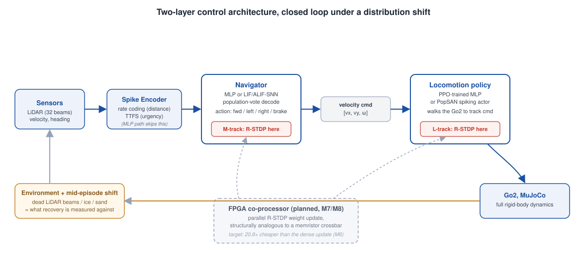
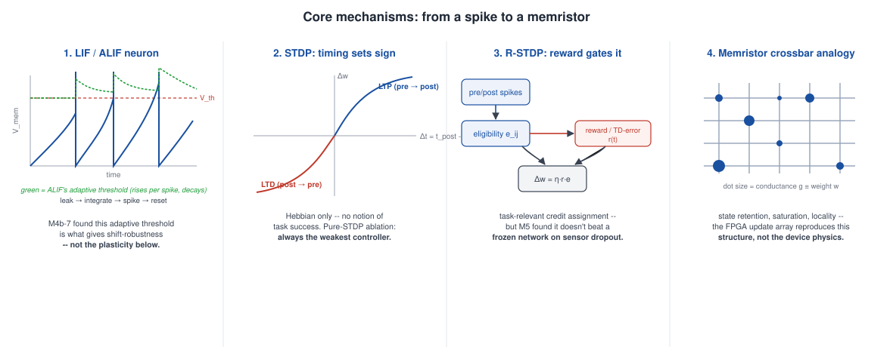

<a id="top"></a>

<nav class="site-nav" aria-label="Section navigation">
  <a href="#d-track" class="nav-d">D &middot; foundation</a>
  <a href="#m-track" class="nav-m">M &middot; navigation</a>
  <a href="#l-track" class="nav-l">L &middot; locomotion</a>
  <a href="concepts.md" class="nav-c">Concepts</a>
  <a href="https://github.com/Kostantinoskanell/thesis/blob/main/docs/references/sota_decisions.md">Decision log</a>
  <a href="https://github.com/Kostantinoskanell/thesis" class="nav-gh">GitHub</a>
</nav>

# Memristor-Inspired Neuromorphic Control for Robotics

[How the SNN pieces work &rarr;](concepts.md) &middot; LIF/ALIF, STDP, R-STDP, e-prop, population coding, and where each one lives in the code.

Undergraduate thesis work (ECE, University of Patras). A hardware-software
co-design comparing a spiking neural network (SNN) with reward-modulated STDP
(R-STDP) against DNN/RL baselines, on a real Unitree Go2 quadruped simulated
with full rigid-body dynamics (MuJoCo / Isaac Lab), under a mid-episode
distribution shift, plus a planned FPGA co-processor structurally analogous
to a memristive crossbar.

Full proposal: [`proposal/proposal.tex`](https://github.com/Kostantinoskanell/thesis/blob/main/proposal/proposal.tex) &middot;
Full milestone plan: [`ROADMAP.md`](https://github.com/Kostantinoskanell/thesis/blob/main/ROADMAP.md) &middot;
Every design decision and why: [`sota_decisions.md`](https://github.com/Kostantinoskanell/thesis/blob/main/docs/references/sota_decisions.md)

## System architecture



Two-layer control, closed loop, under a shift: a navigator decides *where to
go*, a locomotion policy walks the robot there. R-STDP is tested at both
insertion points (M-track and L-track) against the same frozen baseline.

## Core mechanisms {: .track-c #concepts}



| Mechanism | One line |
|---|---|
| LIF / ALIF neuron | Leaky integrate-and-fire; ALIF adds an adaptive threshold that rises per spike and decays, giving longer temporal memory. |
| STDP | Hebbian: `+A_+ exp(-dt/tau)` if pre fires before post (LTP), `-A_- exp(dt/tau)` if post before pre (LTD). No notion of task success. |
| R-STDP | STDP accumulates into an eligibility trace `e_ij`; a reward/TD-error `r(t)` gates consolidation: `dw = eta * r(t) * e_ij`. |
| Memristor analogy | Conductance `g` in `[g_min, g_max]` &equiv; synaptic weight; the FPGA reproduces this *structure* (state retention, saturation, locality), not the device physics. |

Full equations, code pointers, and how e-prop and population coding fit in: [**How the SNN pieces work &rarr;**](concepts.md)

## Results at a glance

*Click any question to jump straight to the full result.*

<table class="quick-links" markdown="0">
<thead><tr><th>Track</th><th>Question</th><th>Metric</th><th>Result</th></tr></thead>
<tbody>
<tr><td>M (navigation)</td><td><a href="#m-energy">Energy vs MLP</a></td><td>SynOps / full accounting</td><td>10.4x / 2.4x cheaper</td></tr>
<tr><td>M (navigation)</td><td><a href="#m-neuron-ablation">Shift-robustness source</a></td><td>frozen-LIF vs frozen-ALIF</td><td>+10 pts (p=0.05) &mdash; it's the neuron model</td></tr>
<tr><td>M (navigation)</td><td><a href="#m-rstdp-dropout">R-STDP recovery vs frozen SNN</a></td><td>sensor dropout, 10 seeds x 30 eps</td><td>no significant effect (6 checks)</td></tr>
<tr><td>M (navigation)</td><td><a href="#m-rstdp-terrain">R-STDP recovery vs frozen SNN</a></td><td>terrain (sand/ice), 10 seeds</td><td>no significant effect either (D18)</td></tr>
<tr><td>M (navigation)</td><td><a href="#m-eprop">e-prop recovery vs frozen SNN</a></td><td>sensor dropout, identical protocol</td><td>also no significant effect (D19) &mdash; null generalizes beyond R-STDP</td></tr>
<tr><td>M (navigation)</td><td><a href="#m-noise">Noise robustness (H4)</a></td><td>success at sigma=0.8</td><td>MLP 38% vs SNN 18% &mdash; refuted</td></tr>
<tr><td>L (locomotion)</td><td><a href="#l-energy">Energy vs MLP</a></td><td>best config (T=5, sparsity-regularized)</td><td>1.04x cheaper</td></tr>
<tr><td>L (locomotion)</td><td><a href="#l-rstdp">R-STDP on the gait</a></td><td>icy terrain</td><td>destabilizes it (honest negative)</td></tr>
<tr><td>L (locomotion)</td><td><a href="#l-walking">Walking policy</a></td><td>spiking-network-controlled Go2</td><td>first working one found in lit. search</td></tr>
<tr><td>D (foundation)</td><td><a href="#d-policy">Locomotion policy</a></td><td>trained from scratch, PPO</td><td>bit-exact sim-to-Windows parity</td></tr>
</tbody>
</table>

---

## D &mdash; dynamics foundation {: .track-d #d-track}

Go2 stands and walks under full physics before any plasticity science runs;
no pretrained policy existed, so one was trained from scratch and exported to
a bit-exact Windows runtime.

<div class="gif-row">
<figure><figcaption class="cap">D1: standing, PD control</figcaption></figure>
<figure><figcaption class="cap">D2/D3a: walking, exported policy</figcaption></figure>
<figure><figcaption class="cap">velocity-tracking parity, train vs. deploy</figcaption></figure>
</div>

| Milestone | Result |
|---|---|
| D1 | height holds ~0.26 m under PD, no collapse |
| D2 | PPO-trained, cmd 1.0 &rarr; actual 0.84 &plusmn; 0.07 m/s |
| D3a | NumPy-vs-JAX parity, max err 2.7e-7 |
| D3 | dynamic nav env: LiDAR raycast + obstacles + shift, ~20x realtime |

<a id="d-policy"></a>D2's locomotion policy (**bit-exact sim-to-Windows parity**, D3a) is the
walking substrate every controller in the M-track and the frozen baseline of
the L-track both drive.

Details: [`D2_go2_rl_go2model`](https://github.com/Kostantinoskanell/thesis/tree/main/archive/D2_go2_rl_go2model), [`D3a_policy_export_windows`](https://github.com/Kostantinoskanell/thesis/tree/main/archive/D3a_policy_export_windows), [`D3_go2_nav_env`](https://github.com/Kostantinoskanell/thesis/tree/main/archive/D3_go2_nav_env)

[&uarr; back to top](#top){: .section-jump}

---

## M &mdash; navigation layer {: .track-m #m-track}

An SNN/MLP decides *where to go* from LiDAR; the D-track policy walks the
robot there. Question: does releasing the SNN to R-STDP recover faster than a
frozen network after a shift?

<div class="gif-row">
<figure><figcaption class="cap">the task: goal + obstacles + mid-episode shift</figcaption></figure>
<figure><figcaption class="cap">privileged A* teacher, original 2D kinematic env (pre-MuJoCo)</figcaption></figure>
<figure><figcaption class="cap">R-STDP on sand: one verified success (aggregate: significantly worse than MLP, see below)</figcaption></figure>
<figure><figcaption class="cap">R-STDP on ice, mu=0.28: verified success</figcaption></figure>
</div>

<a id="m-rstdp-dropout"></a>**Core comparison, sensor dropout (10 seeds x 30 eps each, 95% CI, Holm-corrected):**

| Controller | Success @ dropout=0.30 | Success @ dropout=0.20 (corrected) | Recovery time (eps) |
|---|---|---|---|
| Frozen MLP | 30.3% &plusmn; 7.7% | 34.0% &plusmn; 9.5% | 4.2 / 6.4 |
| Online MLP | 21.0% &plusmn; 12.5% | 24.0% &plusmn; 13.4% | 9.2 / 6.3 |
| Frozen SNN | 11.0% &plusmn; 2.6% | 21.3% &plusmn; 7.2% | 20.3 / 7.7 |
| Pure-STDP SNN | 5.0% &plusmn; 3.4% | 8.7% &plusmn; 4.5% | 28.9 / 20.9 |
| **R-STDP SNN** | 8.7% &plusmn; 3.7% | 19.3% &plusmn; 5.3% | 18.4 / 11.8 |
| TM-NORM SNN | 1.3% &plusmn; 2.2% | 1.7% &plusmn; 2.2% | 30.0 / 30.0 |

R-STDP vs frozen SNN: not significant at either severity (p=0.14, p=0.70).
0.30 was M4's original pick and turned out already floored &mdash; see the
severity sweep below.

<a id="m-neuron-ablation"></a>**Why: the neuron-model ablation (pre-registered, dropout=0.20, 10 seeds x 10 eps):**

| Variant | Success | vs. previous |
|---|---|---|
| Frozen LIF | 7.0% &plusmn; 5.9% | &mdash; |
| Frozen ALIF | 17.0% &plusmn; 9.0% | +10.0 pts, p=0.051 (neuron model alone) |
| R-STDP + ALIF | 12.0% &plusmn; 5.6% | -5.0 pts, p=0.30 (plasticity adds nothing) |

**Severity sweep, all six controllers (5 seeds x 10 eps):**

| Controller | drop=0.10 | drop=0.15 | drop=0.20 | drop=0.30 |
|---|---|---|---|---|
| Frozen MLP | 50.0% | 34.0% | 22.0% | 22.0% |
| Online MLP | 44.0% | 32.0% | 16.0% | 30.0% |
| Frozen SNN | 42.0% | 30.0% | 20.0% | 12.0% |
| Pure-STDP SNN | 10.0% | 8.0% | 4.0% | 2.0% |
| R-STDP SNN | 48.0% | 24.0% | 12.0% | 12.0% |
| TM-NORM SNN | 2.0% | 0.0% | 2.0% | 2.0% |

<a id="m-rstdp-terrain"></a>**Terrain shift -- UPDATE: also does not replicate at rigor (and reverses on sand).**

The n=15/one-seed numbers above (sand: R-STDP 47% "closes the gap"; ice: R-STDP 40% "beats both") were the SAME kind of thin sample that turned out not to replicate for sensor dropout -- and a 10-seed/30-episode/Holm-corrected re-run (at the sand severity the original claim actually used, mu=1.20) confirms it, decisively:

| Terrain | Frozen MLP | Frozen SNN | R-STDP SNN | R-STDP vs Frozen SNN | R-STDP vs Frozen MLP |
|---|---|---|---|---|---|
| Ice (mu=0.28) | 44.7% | 29.0% | 34.0% | +5.0 pts, p=0.393 (n.s.) | -10.7 pts, p=0.156 (n.s.) |
| Sand (mu=1.20) | 55.0% | 42.7% | 40.3% | -2.3 pts, p=0.626 (n.s., numerically worse) | **-14.7 pts, p=0.019 (SIGNIFICANTLY worse)** |

On sand -- the condition M4c's headline claim rested on -- R-STDP is not "closing the gap to the MLP", it is **significantly further from the MLP than the frozen SNN is**. **R-STDP currently has no surviving significant recovery advantage on any shift type tested** (sensor dropout, terrain sand, terrain ice). See `docs/references/sota_decisions.md` D18 for the full account.

<a id="m-eprop"></a>**Is it the rule, or the problem? e-prop says: the problem.** e-prop (Bellec et al. 2020) is a structurally different three-factor rule -- a neuron-dynamics-derived eligibility trace and per-neuron symmetric feedback, instead of R-STDP's Hebbian trace and one global reward scalar (see [How the SNN pieces work](concepts.md)). Tested under the identical sensor-dropout protocol (10 seeds x 30 eps, Holm-corrected, with Frozen SNN and R-STDP SNN re-run fresh alongside it for a real matched-data comparison, not a comparison against old summary statistics):

| dropout | e-prop vs | delta | Holm-corrected p | significant? |
|---|---|---|---|---|
| 0.30 | Frozen SNN | +0.3 pts | 0.902 | no |
| 0.30 | R-STDP SNN | +2.7 pts | 0.711 | no |
| 0.20 | Frozen SNN | +7.3 pts | 0.231 | no |
| 0.20 | R-STDP SNN | +9.3 pts | 0.078 | no |

e-prop does not show a significant advantage over frozen SNN either -- the null result **generalizes beyond R-STDP specifically**. Combined with the neuron-model ablation above (frozen ALIF alone: +10 pts that no plasticity rule tested has topped), the most defensible reading is that **the neuron model, not online synaptic plasticity, is doing the shift-robustness work** in this setup. Full record: [`archive/D1_eprop/README.md`](https://github.com/Kostantinoskanell/thesis/tree/main/archive/D1_eprop), decision log: `docs/references/sota_decisions.md` D19. Remaining open question: the overnight shift-taxonomy sweep (sensor_bias/sensor_range/goal_drift), since the shift-dependence hypothesis may still hold for a shift class not yet tried.

<a id="m-energy"></a>**Energy per decision, 45 nm Horowitz model (nJ):**

| Controller | Inference | Neurons | Encoder | Learning | Total | vs. MLP |
|---|---|---|---|---|---|---|
| Frozen MLP | 1321.7 | &mdash; | &mdash; | &mdash; | 1321.7 | 1.00x |
| Frozen SNN | 125.6 | 420.0 | 4.2 | &mdash; | 549.7 | 2.40x cheaper |
| R-STDP SNN (dense) | 125.1 | 420.0 | 4.2 | 15538.5 | 16087.7 | 0.08x (12x costlier) |
| R-STDP SNN (event-driven, FPGA target) | 125.1 | 420.0 | 4.2 | 747.3 | 1296.5 | 1.02x cheaper |
| Online MLP (backprop) | 1321.7 | &mdash; | &mdash; | 7586.7 | 8908.4 | 0.15x costlier |

Literature-standard view (SynOps only): frozen SNN is **10.4x cheaper**. Per
*successful* navigation, the win disappears: frozen SNN 2276 &mu;J vs. frozen
MLP 2280 &mu;J &mdash; a dead heat.

<a id="m-noise"></a>**Noise robustness (H4), success rate vs. LiDAR noise sigma:**

| Controller | 0 | 0.1 | 0.2 | 0.3 | 0.5 | 0.8 |
|---|---|---|---|---|---|---|
| Frozen MLP | 42% | 52% | 34% | 42% | 34% | **38%** |
| Frozen SNN | 40% | 50% | 40% | 28% | 18% | **18%** |
| R-STDP SNN | 42% | 48% | 30% | 28% | 36% | 34% |

H4 hypothesized the SNN degrades more gracefully; the opposite happened &mdash;
rate coding *samples* the sensor, so noise compounds with sampling noise.

<div class="gif-row">
<figure></figure>
<figure></figure>
<figure></figure>
<figure></figure>
<figure></figure>
<figure></figure>
</div>

Full write-ups: [`M5_full_comparison`](https://github.com/Kostantinoskanell/thesis/tree/main/archive/M5_full_comparison), [`M4b_extras`](https://github.com/Kostantinoskanell/thesis/tree/main/archive/M4b_extras), [`M6_energy`](https://github.com/Kostantinoskanell/thesis/tree/main/archive/M6_energy), [`M4b_terrain_walk_compare`](https://github.com/Kostantinoskanell/thesis/tree/main/archive/M4b_terrain_walk_compare)

[&uarr; back to top](#top){: .section-jump}

---

## L &mdash; locomotion layer {: .track-l #l-track}

The M-track found R-STDP can't fix a *body/physics* fault (icy terrain) from
the navigation layer &mdash; it's below the navigator's interface. This track
puts the spiking network in charge of the gait itself.

<a id="l-walking"></a>

<div class="gif-row">
<figure><figcaption class="cap">final spiking walker, DAgger-robustified</figcaption></figure>
<figure><figcaption class="cap">sparsified, T=5, energy-positive</figcaption></figure>
<figure></figure>
</div>

<a id="l-energy"></a>

| Stage | Result |
|---|---|
| Direct PPO training | collapsed into a belly-flop local optimum (looked like a capacity ceiling until rendered) |
| Distillation + DAgger | walking, robust to sustained commands (final GIF above) |
| Energy (dense, T=8) | 328.9 nJ, **0.57x (costlier)** than the MLP (186.1 nJ) |
| + firing-rate penalty | 266.9 nJ, 0.70x (still costlier) |
| + penalty, T=5 (best) | 178.1-181.0 nJ, **1.04x cheaper**, still walks |
| T=4 | 136.8 nJ, 1.36x cheaper, but **breaks walking** |
| R-STDP on the gait (icy shift) | fall rate rises 25% &rarr; 53% &mdash; **destabilizes**, does not recover |

<a id="l-rstdp"></a>The M-track found R-STDP has no surviving significant recovery advantage on
any nav-layer shift; here, released directly onto the gait itself under icy
terrain, it does not merely fail to help &mdash; **it actively destabilizes an
otherwise-robust walker** (fall rate 25% &rarr; 53%), while never catastrophically
forgetting the base task (anchor holds, ~77% retention). A meaningful
nav-vs-locomotion contrast: reward-modulated plasticity's failure mode is
different at each layer.

Full write-ups: [`L4_gait_check`](https://github.com/Kostantinoskanell/thesis/tree/main/archive/L4_gait_check), [`L5_energy`](https://github.com/Kostantinoskanell/thesis/tree/main/archive/L5_energy)

[&uarr; back to top](#top){: .section-jump}

---

## Repo layout

```
src/nmc/
  envs/go2_nav_env.py     MuJoCo Go2 nav env: LiDAR raycast, obstacles, mid-episode shift
  platform/go2_rl_walker.py   the trained locomotion policy every controller drives
  controllers/            frozen/online MLP, LIF/ALIF-SNN (+R-STDP), TM-NORM baselines
  locomotion/             PopSAN spiking actor + R-STDP for the gait itself (L-track)
  plasticity/stdp.py      online STDP / R-STDP (golden reference for the FPGA)
  eval/{metrics,energy}.py    SynOps/CI metrics + the 45nm energy model (M6/L5)
fpga/                     HDL + PyNQ host (not yet started, see ROADMAP M7/M8)
docs/references/          curated citations + the full dated SOTA-decision log
docs/debug-log/           dated war-stories: symptom -> cause -> fix -> lesson
archive/<milestone>/      figures, GIFs, and full write-ups per milestone
```

Every non-trivial bug: [`docs/debug-log`](https://github.com/Kostantinoskanell/thesis/tree/main/docs/debug-log/).
Every design decision: [`docs/references/sota_decisions.md`](https://github.com/Kostantinoskanell/thesis/blob/main/docs/references/sota_decisions.md).

## Setup

```powershell
# nav-layer / M-track (Windows, CPU): conda env `nmc`, Python 3.11
conda create -n nmc python=3.11 -y
conda install -n nmc -c conda-forge pybullet numpy matplotlib -y
conda run -n nmc python -m pip install snntorch stable-baselines3 gymnasium mujoco
```

Locomotion-track (L) training runs in WSL2 + Isaac Lab (GPU) &mdash; see
[`docs/debug-log/2026-07-21_isaac-lab-wsl-8gb-bringup.md`](https://github.com/Kostantinoskanell/thesis/blob/main/docs/debug-log/2026-07-21_isaac-lab-wsl-8gb-bringup.md).

## Status

M0-M6 (navigation) and L0-L5 (locomotion) are done. Next: M7/M8, the FPGA
co-processor. Full detail: [`ROADMAP.md`](https://github.com/Kostantinoskanell/thesis/blob/main/ROADMAP.md).

---

*Front page for [github.com/Kostantinoskanell/thesis](https://github.com/Kostantinoskanell/thesis).*

<a href="#top" class="back-to-top">&uarr; top</a>
